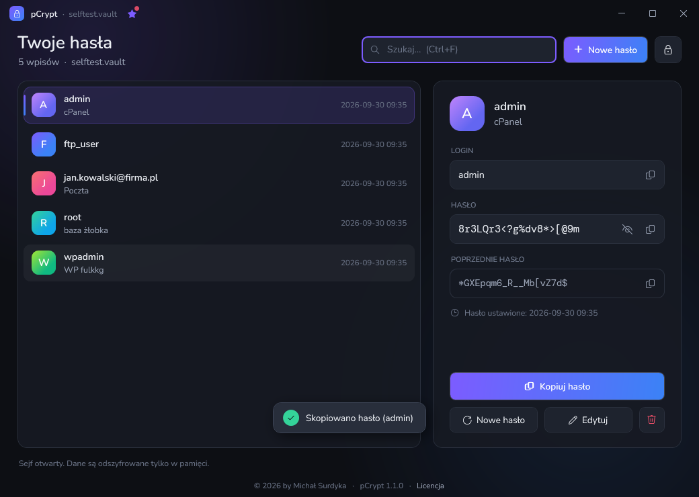

# pCrypt

**pCrypt** to przenośny, szyfrowany sejf haseł dla Windows — jeden plik `pCrypt.exe`, bez instalacji.
Można go nosić na pendrivie razem z plikiem sejfu.



## Pobierz

**[⬇ Pobierz najnowszą wersję pCrypt.exe](https://github.com/Crisples/pcrypt-releases/releases/latest/download/pCrypt.exe)**
· [wszystkie wydania](https://github.com/Crisples/pcrypt-releases/releases)

Wymagania: Windows 10 lub 11 (.NET Framework 4.8 jest wbudowany w system).

> Przy pierwszym uruchomieniu pliku pobranego przeglądarką Windows SmartScreen może pokazać ostrzeżenie
> „Nieznany wydawca”. Wybierz wtedy **Więcej informacji → Uruchom mimo to** albo we Właściwościach pliku
> zaznacz **Odblokuj**. Kolejne wersje instalują się już same, bez tego ostrzeżenia.

## Najważniejsze funkcje

- Szyfrowanie **AES-256** + **HMAC-SHA256**, klucz z hasła głównego przez **PBKDF2-SHA256** (600 000 iteracji).
- Dane tylko lokalnie, w jednym pliku `.vault` — bez chmury i bez kont.
- Generator haseł, wyszukiwarka, historia poprzedniego hasła dla każdego wpisu.
- Kopiowanie do schowka z automatycznym czyszczeniem po 30 s (bez historii schowka Windows).
- Automatyczna blokada po 5 minutach bezczynności i przy zablokowaniu Windows.
- Automatyczne aktualizacje z podpisem cyfrowym — pCrypt instaluje tylko pliki podpisane przez autora.

## Pierwsze kroki

1. Wrzuć `pCrypt.exe` do folderu, w którym ma leżeć sejf (np. na pendrive).
2. Uruchom i ustaw **hasło główne** (min. 12 znaków). **Nie da się go odzyskać** — zapamiętaj je.
3. Rób kopie zapasowe pliku `pcrypt.vault` (poprzednia wersja po każdym zapisie trafia też do `pcrypt.vault.bak`).

Ustawienia są w pliku `pcrypt.ini` obok programu. `aktualizacje=0` wyłącza sprawdzanie nowych wersji.

## Aktualizacje i ich weryfikacja

Przy starcie pCrypt sprawdza najnowsze wydanie w tym repozytorium i pyta o instalację. Każde wydanie zawiera
`pCrypt.update` — manifest z numerem wersji i skrótem SHA-256 pliku, podpisany kluczem ECDSA P-256 autora.
Aplikacja odrzuci plik z błędnym podpisem, innym skrótem albo starszą wersją.

Skrót pobranego pliku sprawdzisz ręcznie w PowerShellu i porównasz z linią `sha256=` w `pCrypt.update`:

```powershell
(Get-FileHash .\pCrypt.exe -Algorithm SHA256).Hash.ToLower()
```

## Licencja

pCrypt jest darmowy (freeware) do użytku prywatnego i firmowego. Szczegóły: [LICENSE.txt](LICENSE.txt).
Copyright © 2026 by Michał Surdyka.

Program zawiera czcionki Nunito i DM Mono na licencji SIL Open Font License 1.1.

## Zgłoszenia

Błędy i pomysły: [Issues](https://github.com/Crisples/pcrypt-releases/issues).
