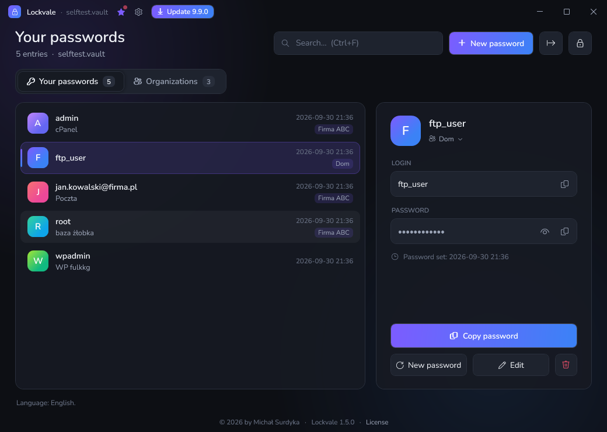

# Lockvale

**[English below](#english)** · Polski

**Lockvale** to przenośny, szyfrowany sejf haseł dla Windows — jeden plik `Lockvale.exe`, bez instalacji.
Można go nosić na pendrivie razem z plikiem sejfu.

> Wcześniej program nazywał się **pCrypt**. Pliki `pcrypt.vault` i `pcrypt.ini` są odczytywane bez zmian —
> wystarczy położyć `Lockvale.exe` obok nich. Starsze sejfy są po pierwszym odblokowaniu przenoszone na Argon2id
> (kopia oryginału: `*.sejf1.bak`).


## Pobierz

**[⬇ Pobierz najnowszą wersję Lockvale.exe](https://github.com/Crisples/lockvale-releases/releases/latest/download/Lockvale.exe)**
· [wszystkie wydania](https://github.com/Crisples/lockvale-releases/releases)

Wymagania: Windows 10 lub 11 (.NET Framework 4.8 jest wbudowany w system).

> Przy pierwszym uruchomieniu pliku pobranego przeglądarką Windows SmartScreen może pokazać ostrzeżenie
> „Nieznany wydawca”. Wybierz wtedy **Więcej informacji → Uruchom mimo to** albo we Właściwościach pliku
> zaznacz **Odblokuj**. Kolejne wersje instalują się już same, bez tego ostrzeżenia.

## Najważniejsze funkcje

- Szyfrowanie **AES-256** + **HMAC-SHA256**, klucz z hasła głównego przez **Argon2id** (64 MB pamięci na każdą próbę).
- Eksport do CSV, żeby dane nigdy nie były zamknięte tylko w Lockvale.
- Dane tylko lokalnie, w jednym pliku `.vault` — bez chmury i bez kont.
- Generator haseł, wyszukiwarka, historia poprzedniego hasła dla każdego wpisu.
- Kopiowanie do schowka z automatycznym czyszczeniem po 30 s (bez historii schowka Windows).
- Automatyczna blokada po 5 minutach bezczynności i przy zablokowaniu Windows.
- Automatyczne aktualizacje z podpisem cyfrowym — Lockvale instaluje tylko pliki podpisane przez autora.
- Interfejs po polsku i po angielsku (wybór w ustawieniach pod zębatką).

## Pierwsze kroki

1. Wrzuć `Lockvale.exe` do folderu, w którym ma leżeć sejf (np. na pendrive).
2. Uruchom i ustaw **hasło główne** (min. 12 znaków). **Nie da się go odzyskać** — zapamiętaj je.
3. Rób kopie zapasowe pliku `lockvale.vault` (poprzednia wersja po każdym zapisie trafia też do `lockvale.vault.bak`).

Ustawienia są w pliku `lockvale.ini` obok programu. `aktualizacje=0` wyłącza sprawdzanie nowych wersji.

## Aktualizacje i ich weryfikacja

Przy starcie Lockvale sprawdza najnowsze wydanie w tym repozytorium i pyta o instalację. Każde wydanie zawiera
`Lockvale.update` — manifest z numerem wersji i skrótem SHA-256 pliku, podpisany kluczem ECDSA P-256 autora.
Aplikacja odrzuci plik z błędnym podpisem, innym skrótem albo starszą wersją.

Skrót pobranego pliku sprawdzisz ręcznie w PowerShellu i porównasz z linią `sha256=` w `Lockvale.update`:

```powershell
(Get-FileHash .\Lockvale.exe -Algorithm SHA256).Hash.ToLower()
```

## Licencja

Lockvale jest darmowy (freeware) do użytku prywatnego i firmowego. Szczegóły: [LICENSE.txt](LICENSE.txt).
Copyright © 2026 by Michał Surdyka.

Program zawiera czcionki Nunito i DM Mono na licencji SIL Open Font License 1.1.

## Zgłoszenia

Błędy i pomysły: [Issues](https://github.com/Crisples/lockvale-releases/issues).

---

## English

**Lockvale** is a portable, encrypted password vault for Windows — a single `Lockvale.exe` file, no installation.
You can carry it on a USB drive together with your vault file.



**[⬇ Download the latest Lockvale.exe](https://github.com/Crisples/lockvale-releases/releases/latest/download/Lockvale.exe)**
· [all releases](https://github.com/Crisples/lockvale-releases/releases)

Requirements: Windows 10 or 11 (.NET Framework 4.8 is built into the system).
The app uses the Windows display language (Polish or English); you can change it in the settings (gear icon).

> The first time you run a file downloaded with a browser, Windows SmartScreen may show an “Unknown publisher”
> warning. Choose **More info → Run anyway**, or tick **Unblock** in the file's Properties.
> Later versions install automatically, without this warning.

### Features

- **AES-256** + **HMAC-SHA256** encryption, key derived from the master password with **Argon2id** (64 MB of memory per guess).
- Export to CSV, so your data is never locked into Lockvale.
- Your data stays local, in a single `.vault` file — no cloud, no accounts.
- Password generator (14–48 characters), search, organizations, previous password kept for every entry.
- Copy to clipboard with automatic clearing after 30 s (excluded from Windows clipboard history).
- Automatic lock after 5 minutes of inactivity and when Windows is locked.
- Digitally signed automatic updates — Lockvale installs only files signed by the author.

### Getting started

1. Put `Lockvale.exe` in the folder where the vault should live (e.g. on a USB drive).
2. Run it and set a **master password** (at least 12 characters). **It cannot be recovered** — remember it.
3. Back up `lockvale.vault` (after every save the previous version is also kept in `lockvale.vault.bak`).

Settings are stored in `lockvale.ini` next to the program. `aktualizacje=0` turns off update checks,
`jezyk=en` / `jezyk=pl` sets the language.

### Updates and verification

At startup Lockvale checks the latest release in this repository and asks before installing it. Every release includes
`Lockvale.update` — a manifest with the version number and the SHA-256 hash of the file, signed with the author's
ECDSA P-256 key. The app rejects files with an invalid signature, a different hash or an older version.

You can check the hash of a downloaded file in PowerShell and compare it with the `sha256=` line in `Lockvale.update`:

```powershell
(Get-FileHash .\Lockvale.exe -Algorithm SHA256).Hash.ToLower()
```

### License

Lockvale is free (freeware) for personal and commercial use. Details: [LICENSE.txt](LICENSE.txt) (Polish and English).
Copyright © 2026 by Michał Surdyka. Includes the Nunito and DM Mono fonts under the SIL Open Font License 1.1.

Bugs and ideas: [Issues](https://github.com/Crisples/lockvale-releases/issues).
